# Firefox Hardening

## 1.- Introducción a Firefox y por qué es ideal para la privacidad


Firefox es uno de los mejores navegadores FOSS que existe por varios motivos:

- **Independencia de Chromium:**  Firefox usa su propio motor llamado Gecko, lo cual es muy importante tener en cuenta para evitar el monopolio de Chromium. Además permite evitar imposiciones de estándares implantados por Google.
- **Arquitectura modular:**  A diferencia de otros navegadores, Firefox permite un control absoluto sobre directivas internas a través de editores de preferencias y archivos declarativos que modificaremos en esta guía.
- **Mitigación de Fingerprinting:**  Integración de protecciones nativas derivadas del proyecto Tor Browser, que estandarizan HTML5, el agente de usuario, zonas horarias y métricas de pantalla para camuflar al usuario.

‍

Aun siendo muy buen navegador, este por defecto viene con una configuración de recolección de datos y telemetría que nos gustaría limitar y controlar al milímetro nosotros mismos desde las configuraciones de privacidad.

### ¿Qué telemetría envía exactamente Firefox por defecto?

Al igual que la mayoría de navegadores, Firefox suele enviar el llamado "main ping", que se envía periódicamente y contiene varios datos de uso y entorno, entre ellos el Hardware, Sistema Operativo, métricas de sesión, ecosistema del navegador, motor de búsquedas y derivados.

También existe el "event ping", registrando interacciones específicas del usuario con la interfaz del navegador. Esto incluye clics, cambios de preferencias, uso de las DevTools...

Por otro lado tenemos "Crash ping" que hace un volcado de pila y el estado de la memoria cuando detecta que una pestaña se crashea.

Por último, por defecto Firefox habilita la opción de instalar y ejecutar estudios de forma silenciosa para que contacte con los servidores regularmente para recibir configuraciones remotas y probar nuevas funciones. Aunque no es "telemetría" en el sentido estricto de analíticas, Firefox envía hashes de los sitios que visitas y de archivos que descargas a los servidores de Google Safe Browsing para comprobar si son maliciosos.

‍

## ⚠️ RECOMENDACIONES ANTES DE SEGUIR LA GUÍA

Si vas a proceder a seguir la guía del hardening teniendo un perfil de Firefox existente, recomiendo encarecidamente crear una copia de seguridad del perfil por si en algún momento el hardening falla y necesitamos el perfil de vuelta.

### 1.- Copia en Linux

Dependiendo de cómo hayas instalado Firefox, la ruta del perfil junto a las configuraciones varía:

- **Nativo (apt/pacman...):**  `~/.mozilla/Firefox/`
- **Flatpak:**  `~/.var/app/org.mozilla.Firefox/.mozilla/Firefox/`
- **Snap:**  `~/snap/Firefox/common/.mozilla/Firefox/`

Es fundamental asegurarse que Firefox está cerrado (`killall -9 Firefox`).

Debéis identificar en la ruta correspondiente vuestro perfil, que suele ser el perfil por defecto. Si no sabemos el perfil que tenemos podemos abrir Firefox y en la barra de búsqueda poner `about:profiles`

‍

Una vez en la ruta, empaquetaremos el perfil completo usando tar, ya que mantiene permisos y enlaces simbólicos.

```bash
tar -czvf ~/Firefox_profile_backup.tar.gz ~/.mozilla/Firefox/xxxxxx.default-release/

# Opcionalmente copiarlo en un directorio dirigido
cp -r ~/.mozilla/Firefox/xxxxxx.default-release/ ~/copia_perfil_Firefox/
```

‍

### 2.- Copia en Windows

Verificar primero que Firefox está cerrado completamente, esto se puede ver desde el administrador de tareas (Ctrl + shift + Esc).

Ahora presionaremos la combinación Windows + R para abrir el cuadro de "Ejecutar".

Introduciremos la siguiente variable:

```bash
%APPDATA%\Mozilla\Firefox\Profiles\
```

Esto nos llevará a la respectiva carpeta de perfiles.

Localizaremos la carpeta de nuestro perfil (si no sabes cual es, podéis hacer lo mismo que expliqué en la copia de linux).

Copia la carpeta entera y pégala en una ubicación segura.

Aquí una alternativa rápida por PowerShell:

```powershell
Copy-Item -Path "$env:APPDATA\Mozilla\Firefox\Profiles\*.default-release" -Destination "$env:USERPROFILE\Desktop\Firefox_Backup" -Recurse
```

Si después del hardening tenéis problemas con Firefox, basta con borrar toda la carpeta de perfiles de Firefox y pegar la copia que hicimos.

‍

## 2.- Hardening

Para guiar el proceso, estaré usando una máquina virtual Debian recién instalada, el cual le instalaremos Firefox desde los paquetes APT para tener un perfil totalmente limpio. Este proceso es igual tanto en Lenux como en Windows.

‍

### 2.1.- Configuración inicial desde la GUI

Antes de tocar los archivos de configuración, estableceremos una configuración directamente desde los ajustes nativos de Firefox.

#### 2.1.1.- Motor de búsqueda

Empezaremos con el motor de búsqueda. En Firefox el buscador predeterminado es Google, así que haremos lo siguiente:

- Vamos a **Ajustes > Buscar**
- En el apartado de "Buscador predeterminado" seleccionaremos DuckDuckGo
- Como extra podéis desactivar el resto de buscadores que no uséis como Bing, Google, Ebay...

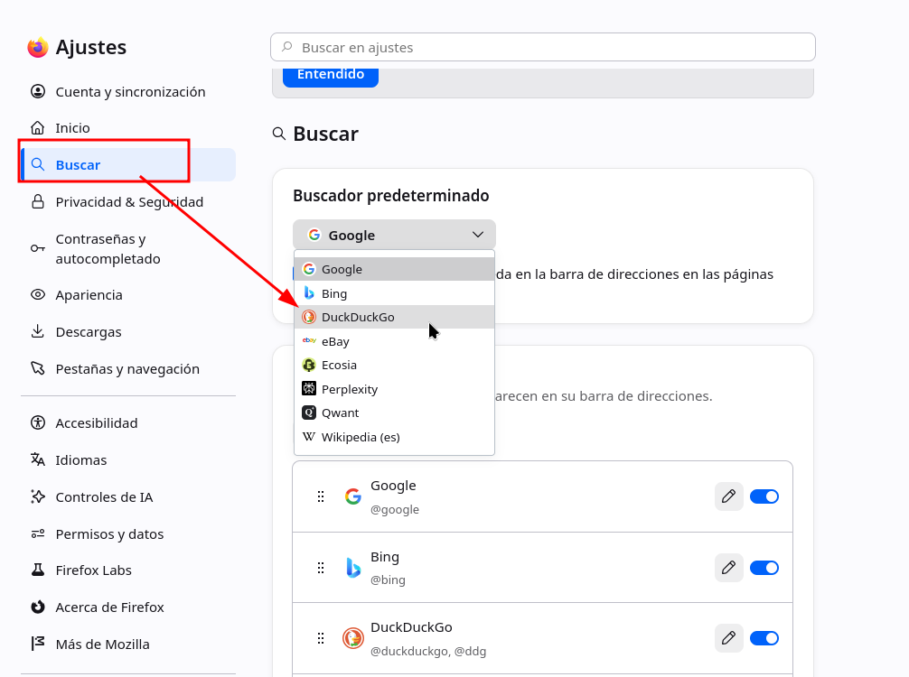

‍

(NOTA: si no deseáis usar duckduckgo por sus antiguas polémicas, Qwant es muy buen buscador privado sobre todo si eres de Europa, o Ecosia).

‍

#### 2.1.2.- DNS sobre HTTPS (DoH)

Por defecto, las peticiones DNS viajan en texto plano, permitiendo que tu ISP y cualquiera que esté en la red local pueda saber qué dominios visitas.

- Vamos a la pestaña de Privacidad y Seguridad
- Abajo de todo le damos a "DNS sobre HTTPS" y a ajustes avanzados

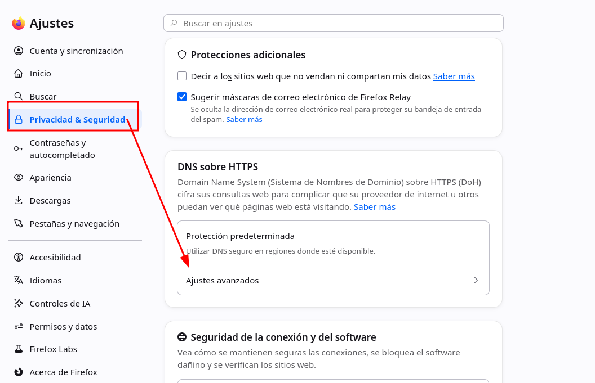

- Le damos a "Personalizado" y pondremos el siguiente proveedor: "`https://dns.quad9.net/dns-query`", así estaremos usando el proveedor de Quad9, el cual va cifrado.

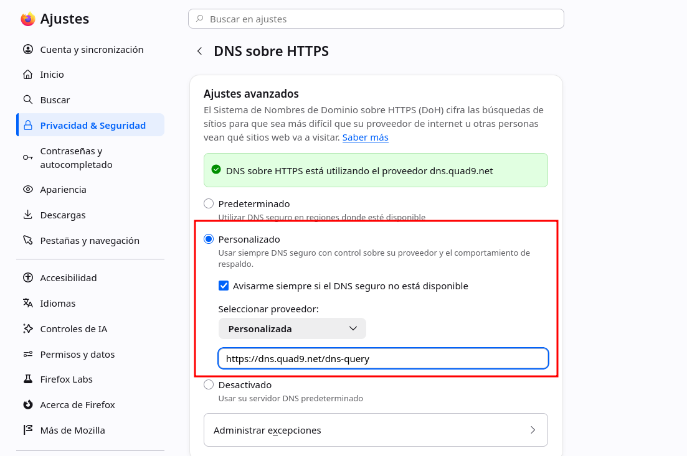

Otro proveedor muy bueno es Mullvad, el cual es con el siguiente URL:

"`https://dns.mullvad.net/dns-query`"

O si lo prefieres puedes usar el DNS de Cloudflare que aunque no sea tan privado como estos, es bastante rápido y mejor que el de Google y el de tu ISP.

‍

#### 2.1.3.- Modo solo HTTPS

- En **Privacidad & Seguridad**, vamos al final y configuración avanzada.

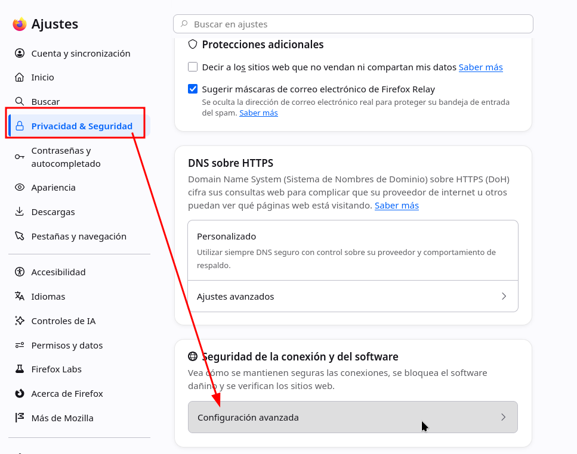

- Le damos a "Activar el modo solo-HTTPS en todas las ventanas".

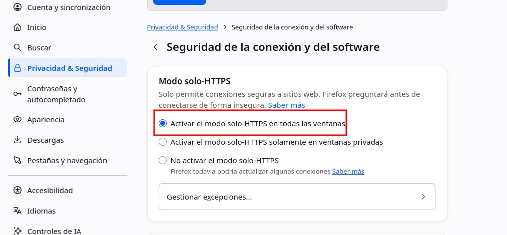

‍

### 2.2 Hardening a user.js

Este archivo es el que contiene toda la configuración de nuestro perfil, el cual se estructura en módulos. Para que no tengáis que modificar módulo por módulo cada configuración he preparado un user.js el cual podéis descargar desde el siguiente enlace:

[https://github.com/D4vKry/Firefox-userjs/blob/main/user.js](https://github.com/D4vKry/Firefox-userjs/blob/main/user.js)

Explicaremos punto por punto que configuración toca nuestro archivo:

‍

#### 2.2.1.- Eliminar la Telemetría

Mozilla usa "Normandy" para inyectar cambios de configuración remotos y "Shield" para estudios en segundo plano:

```JavaScript
// ============================================================================
// 1. TELEMETRÍA, ESTUDIOS Y RECOLECCIÓN DE DATOS
// ============================================================================
// Desactiva el envío de datos de salud y uso general
user_pref("datareporting.policy.dataSubmissionEnabled", false);
user_pref("datareporting.healthreport.uploadEnabled", false);
user_pref("toolkit.telemetry.unified", false);
user_pref("toolkit.telemetry.enabled", false);
user_pref("toolkit.telemetry.server", "data:,"); // Anula el endpoint de envío
user_pref("toolkit.telemetry.archive.enabled", false);
user_pref("toolkit.telemetry.bhrPing.enabled", false);
user_pref("toolkit.telemetry.firstShutdownPing.enabled", false);
// Bloquea los estudios de Normandy y Shield (Inyecciones remotas)
user_pref("app.normandy.enabled", false);
user_pref("app.normandy.api_url", "");
user_pref("app.shield.optoutstudies.enabled", false);
// Desactiva los reportes de cuelgues (Crash Reports)
user_pref("breakpad.reportURL", "");
user_pref("browser.tabs.crashReporting.sendReport", false);

```

#### 2.2.2.- Fugas de metadatos

Con el fin de acelerar la navegación, Firefox intenta adivinar dónde vas a hacer clic, resolviendo peticiones DNS y precargando ciertos recursos. Esto al final significa que tu ip consulta con dominios que no solicitas, dejando un rastro en los servidores destino y en tu ISP:

```JavaScript
// ============================================================================
// 2. PREFETCHING Y CONEXIONES ESPECULATIVAS
// ============================================================================
user_pref("network.prefetch-next", false); // Evita descargar webs enteras anticipadamente
user_pref("network.dns.disablePrefetch", true); // Detiene la resolución DNS anticipada
user_pref("network.predictor.enabled", false);
user_pref("network.http.speculative-parallel-limit", 0);
user_pref("browser.places.speculativeConnect.enabled", false); // Desactiva conexiones al pasar el ratón por encima de enlaces
```

‍

#### 2.2.3.- Protección de Identidad de Red

WebRTC es una tecnología que permite la comunicación en tiempo real de datos entre navegadores web y apps móviles. Es conocido por causar fugas de direcciones IP real incluso usando VPN, ya que usa UDP de forma directa. En el archivo dejo 2 opciones, la primera es deshabilitar completamente WebRTC, lo que puede llevar a romper cierto contenido en páginas, y la opción B que es la recomendada restringe cierta configuración para evitar filtraciones de red.

```JavaScript
// ============================================================================
// 3. WEBRTC Y FUGAS DE RED
// ============================================================================
// OPCIÓN A: Deshabilitar WebRTC por completo (Rompe llamadas de voz/vídeo web)
// user_pref("media.peerconnection.enabled", false);

// OPCIÓN B: Restringir WebRTC para que pase por el proxy/VPN y no filtre IPs locales
user_pref("media.peerconnection.ice.default_address_only", true);
user_pref("media.peerconnection.ice.proxy_only_if_behind_proxy", true);
user_pref("media.peerconnection.ice.no_host", true);

// Prevenir bypass de proxys
user_pref("network.proxy.socks_remote_dns", true); // Fuerza a que las consultas DNS vayan por el túnel SOCKS
```

‍

#### 2.2.4.- Mitigación de Fingerprinting

En lugar de intentar bloquear todos los scripts de rastreo, la siguiente directiva estandariza nuestro navegador para que parezca idéntico al de miles de otros usuarios para evitar Fingerprinting.

```JavaScript
// ============================================================================
// 4. RESISTENCIA AL FINGERPRINTING
// ============================================================================
user_pref("privacy.resistFingerprinting", true);
// Fuerza el aislamiento dinámico de cookies y almacenamiento (dFPI)
user_pref("network.cookie.cookieBehavior", 5); // 5 = Total Cookie Protection
// Previene el rastreo a través del estado de la batería o el tipo de conexión
user_pref("dom.battery.enabled", false);
// Desactiva la API de Gamepad (usada frecuentemente para fingerprinting de hardware)
user_pref("dom.gamepad.enabled", false);
```

‍

#### 2.2.5.- Reducción de Superficie de Ataque

Algunos Zero-Day suelen ocurrir en la compilación JIT del motor JavaScript o en las interacciones con los drivers de la tarjeta gráfica.

```JavaScript
// ============================================================================
// 5. REDUCCIÓN DE SUPERFICIE DE ATAQUE
// ============================================================================
// Deshabilitar WebGL (Evita fingerprinting de GPU y vulnerabilidades de drivers gráficos)
user_pref("webgl.disabled", true);
// Evita que las páginas web manipulen el portapapeles de forma silenciosa
user_pref("dom.event.clipboardevents.enabled", false);
// Bloquea el acceso a la geolocalización a nivel de núcleo del navegador
user_pref("geo.enabled", false);

// --- SECCIÓN EXTREMA: Deshabilitar JIT (IonMonkey / Baseline) ---
// ADVERTENCIA: Esto hace que Firefox sea significativamente más lento en sitios web pesados,
// pero elimina clases enteras de vulnerabilidades de corrupción de memoria y ejecución de código.
// user_pref("javascript.options.ion", false);
// user_pref("javascript.options.baselinejit", false);
// user_pref("javascript.options.wasm", false);
```

‍

También he incluido una opción comentada sobre deshabilitar la compilación Just-In-Time, pero puede ralentizar bastante el navegador, por lo que solo lo recomiendo activar si se trata de casos específicos.

‍

#### 2.2.6.- Limpieza de la pestaña Home

Por último configuramos la página principal para quitar todos los patrocinios y widgets los cuales no prestamos atención y consumen recursos.

```JavaScript
// ============================================================================
// 6. LIMPIEZA DE LA PÁGINA DE NUEVA PESTAÑA (ACTIVITY STREAM)
// ============================================================================
// Desactiva los accesos directos patrocinados (Amazon, Temu, etc.)
user_pref("browser.newtabpage.activity-stream.showSponsored", false);
user_pref("browser.newtabpage.activity-stream.showSponsoredTopSites", false);

// Desactiva la sección de Pocket, el clima y otros feeds que consumen red
user_pref("browser.newtabpage.activity-stream.feeds.section.topstories", false);
user_pref("browser.newtabpage.activity-stream.feeds.topsites", false);
user_pref("browser.newtabpage.activity-stream.feeds.weatherfeed", false);
user_pref("browser.newtabpage.activity-stream.showWeather", false);
user_pref("browser.newtabpage.activity-stream.system.showWeather", false);
```

‍

Ahora para meter el user.js, de nuevo, nos aseguraremos de que Firefox está 100% cerrado y entraremos a la carpeta de nuestro perfil el cual hicimos la copia, justo ahí pegaremos el user.js.

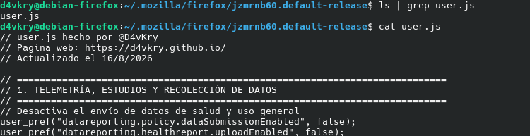

‍

Abrimos Firefox y comprobamos que tenemos una interfaz mucha mas limpia sin pop-ups.

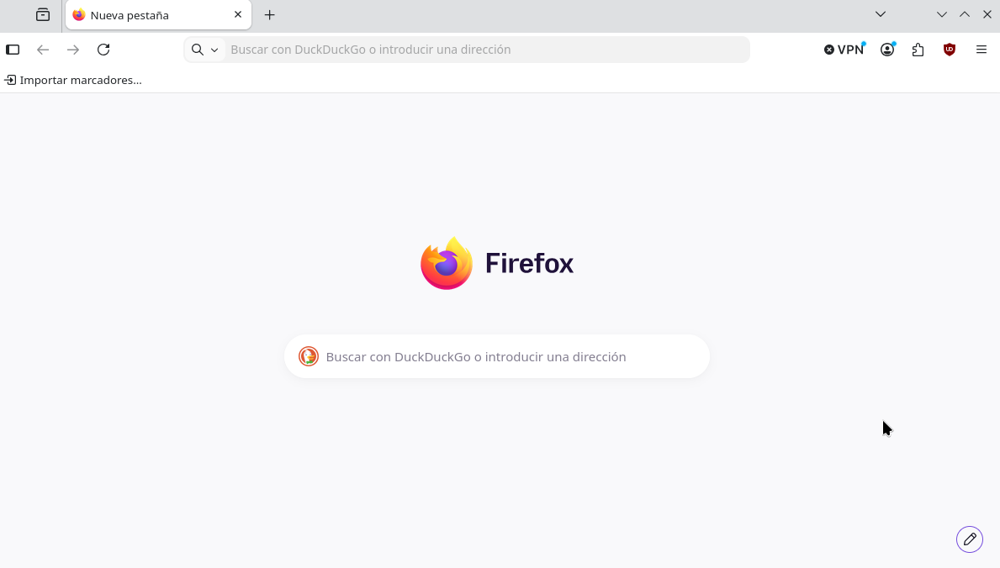

‍

NOTA: como Firefox actualiza constantemente los widgets es probable que aparezcan nuevos, por lo que es recomendable desactivarlo directamente desde el menú de abajo a la derecha como en la caputra.

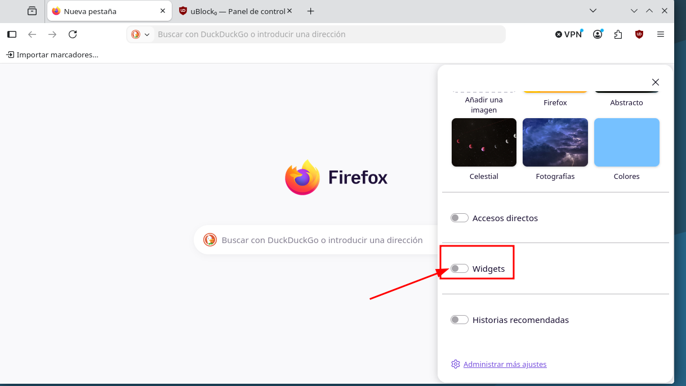

‍

### 2.3 Extensiones

En esta sección, personalmente, solo recomendaré instalar uBlock Origin

[https://addons.mozilla.org/es-ES/Firefox/addon/ublock-origin/](https://addons.mozilla.org/es-ES/Firefox/addon/ublock-origin/)

Esta extensión bloquea anuncios, cookies y scripts innecesarios que recopilan información.

También recomiendo encarecidamente no instalar una gran cantidad de extensiones, ya que lo que conseguimos es aumentar el Fingerprint, ampliar la superficie de ataques y ralentizar el navegador.

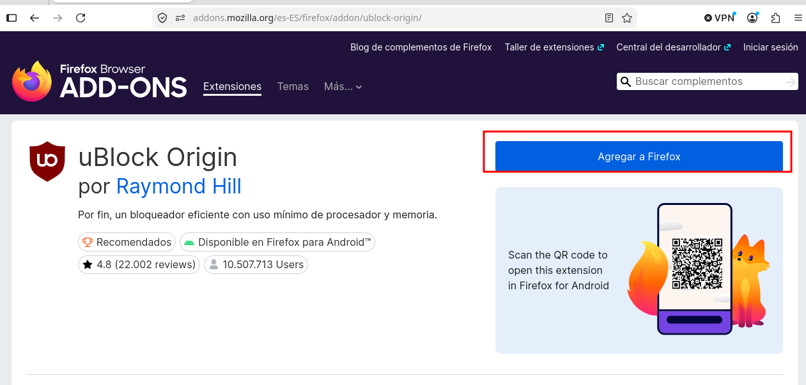

‍

### 2.3.1.- Configuración de uBlock

uBlock Origin ya viene con una configuración por defecto muy buena, pero vamos a ampliar la lista de filtros. Para ello, seleccionaremos la extensión y le daremos a "Abrir panel de control".

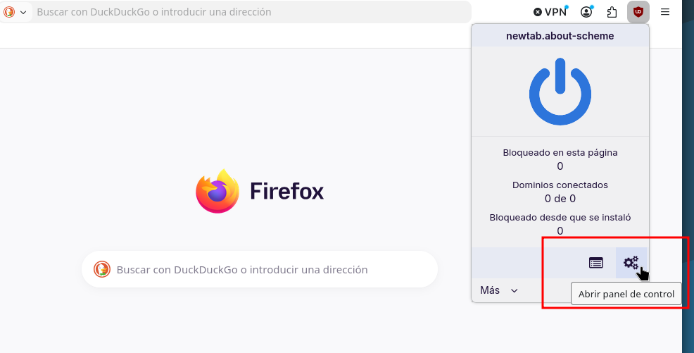

‍

En el apartado de "Lista de filtros" marcaremos las siguientes listas:

- **Privacidad:**
    - AdGuard Tracking Protection
    - AdGuard/uBO – URL Tracking Protection
    - Block Outsider Intrusion into LAN
- **Protección de malware, seguridad:**
    - Online Malicious URL Blocklist
    - Phishing URL Blocklist
- **Anuncios:**
    - EasyList
    - AdGuard - Ads
- **Avisos de cookies:**
    - EasyList/uBO
    - AdGuard/uBO

Debería quedar como en la captura de pantalla:

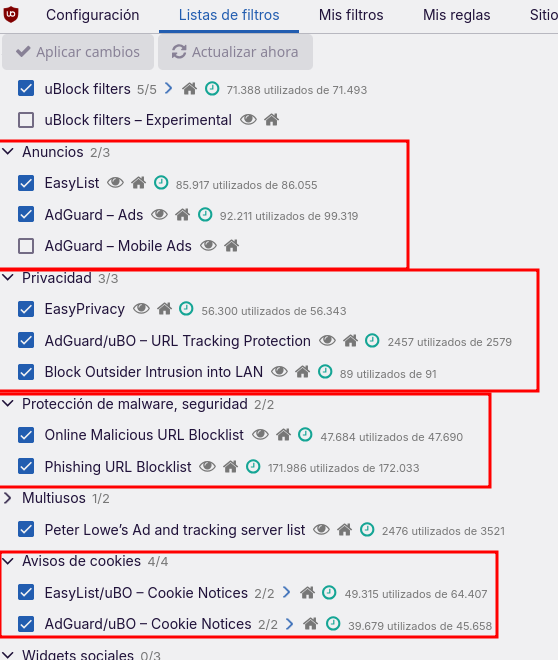

‍

## 3.- Comprobación del Hardening

Para comprobar que todas las directivas que hemos aplicado en nuestro `user.js` y en uBlock Origin está haciendo su trabajo, os recomiendo visitar las siguientes páginas:

- Cover Your Tracks (EFF): Esta herramienta analizará nuestro navegador. Si todo está correcto, dirá que bloqueamos rastreadores y anuncios invisibles. También dirá si nuestra huella es única.
- Link: [https://coveryourtracks.eff.org/](https://coveryourtracks.eff.org/)
- Hacemos la comprobación y vemos que tenemos una protección fuerte, por lo que comprueba que nuestros filtros están funcionando.

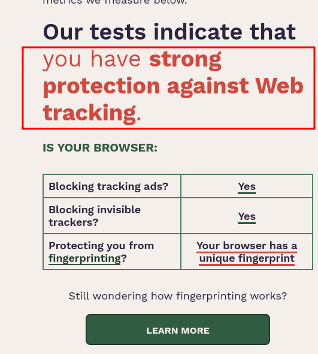

Otros links donde podéis comprobar la configuración de privacidad y seguridad:

[https://browserleaks.com](https://browserleaks.com)

[https://dnsleaktest.com](https://dnsleaktest.com)

‍

## 4.- Alternativas y Proyectos Recomendados

Si leer esta guía te ha parecido interesante pero crees que mantener un archivo de configuración y auditarlo después de cada actualización es tedioso, existen proyectos de código abierto que ya hacen este hardening por ti desde el principio:

- **LibreWolf**: Es un fork directo de Firefox diseñado específicamente para maximizar la privacidad y la seguridad de fábrica. Viene con la telemetría eliminada desde el código fuente, uBlock preinstalado y configuraciones restrictivas por defecto. Es la mejor opción si te interesa el hardening pero no quieres pasar por el proceso.

  - Link: [https://librewolf.net/](https://librewolf.net/)
- **Mullvad Browser**: Desarrollado en colaboración con el Tor Project, este navegador mitiga el fingerprint al extremo. Está pensado para usarse junto a una VPN comercial y comparte la misma filosofía que Tor: hacer que todos sus usuarios parezcan exactamente el mismo.

  - Link: [https://mullvad.net/es/browser](https://mullvad.net/es/browser)
- **Arkenfox user.js**: Si prefieres seguir usando Firefox oficial pero quieres la plantilla de seguridad definitiva, el proyecto Arkenfox en GitHub mantiene el `user.js` más riguroso y actualizado de la comunidad.

  - Link: [https://github.com/arkenfox/user.js/](https://github.com/arkenfox/user.js/)

‍

### Fuentes:

[https://brainfucksec.github.io/Firefox-hardening-guide](https://brainfucksec.github.io/Firefox-hardening-guide)

[https://github.com/arkenfox/user.js](https://github.com/arkenfox/user.js)

[https://www.privacyguides.org/es/desktop-browsers/](https://www.privacyguides.org/es/desktop-browsers/)

[https://wiki.archlinux.org/title/Firefox/Privacy](https://wiki.archlinux.org/title/Firefox/Privacy)

[https://support.mozilla.org/es/kb/como-detener-las-conexiones-automaticas-de-Firefox](https://support.mozilla.org/es/kb/como-detener-las-conexiones-automaticas-de-Firefox)

[https://restoreprivacy.com/Firefox-privacy/](https://restoreprivacy.com/Firefox-privacy/)

<br>

---
<div align="center">
  <small>
    © 2026 David Veiga (D4vKry). Este trabajo está distribuido bajo una licencia <a href="https://creativecommons.org/licenses/by-nc-sa/4.0/deed.es" target="_blank">CC BY-NC-SA 4.0</a>.
  </small>
</div>
